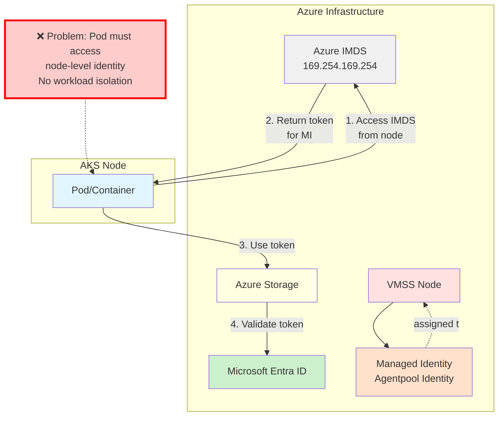
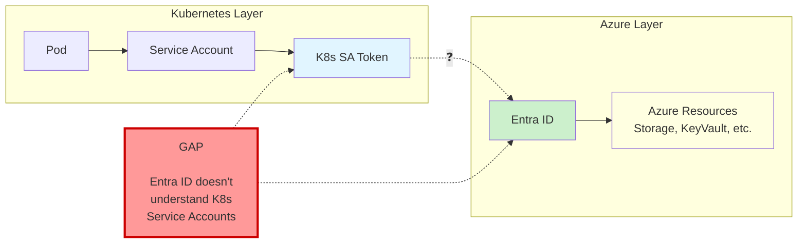
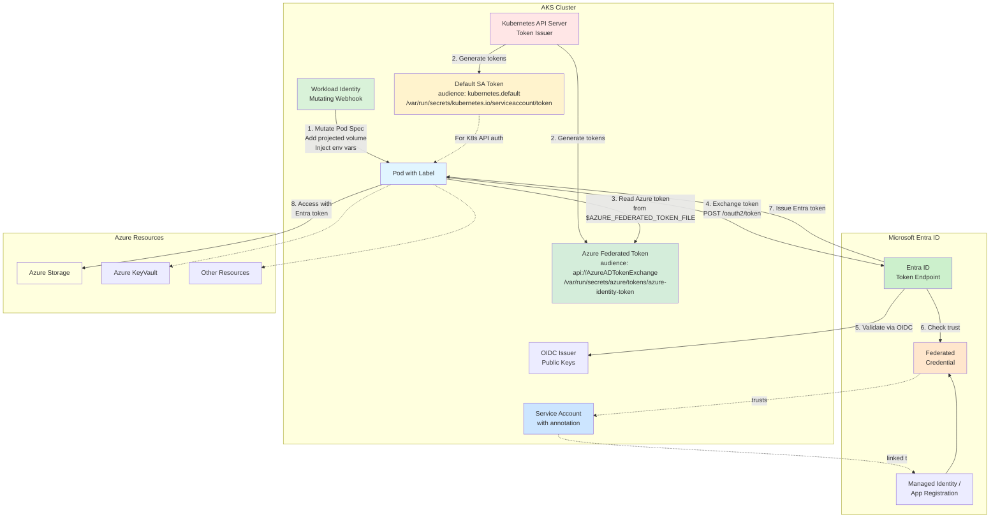
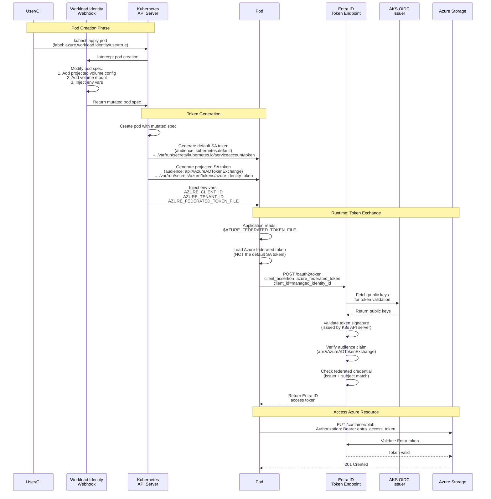
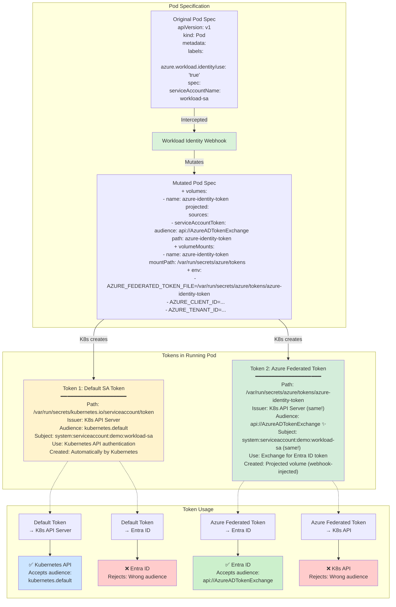
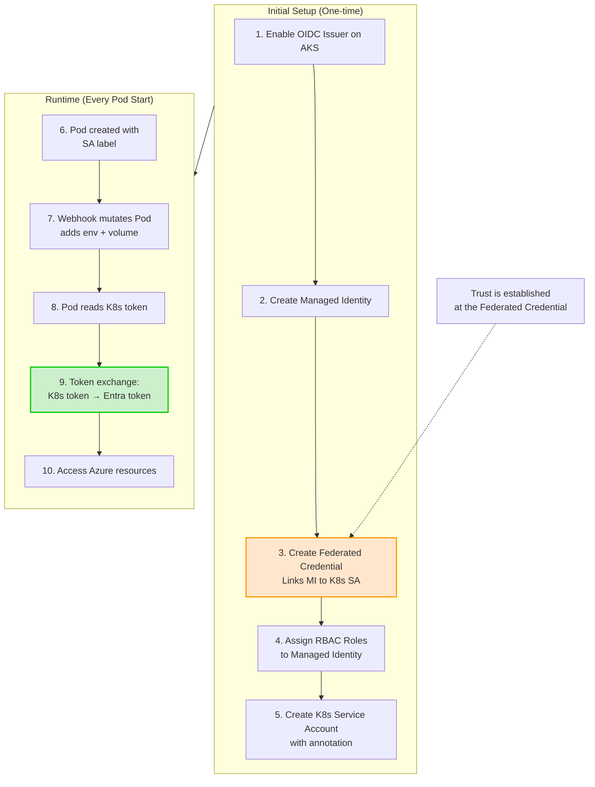
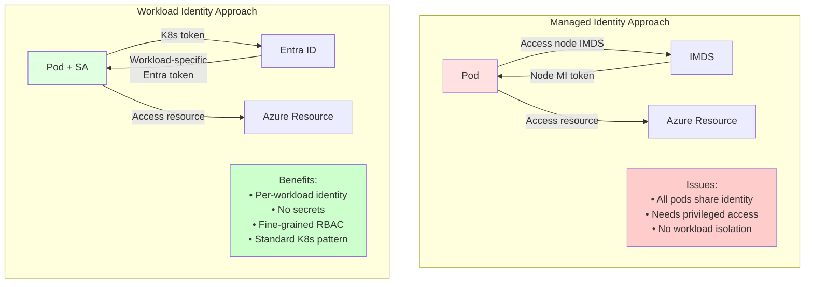

# AKS Workload Identity - From Managed Identity to Workload Identity Federation

This guide provides a comprehensive explanation of identity management in Azure Kubernetes Service (AKS), covering managed identities, their limitations for Kubernetes workloads, and how workload identity federation solves these challenges.

## Table of Contents
- [Part 1: Understanding Managed Identity](#part-1-understanding-managed-identity)
- [Part 2: The Kubernetes Identity Challenge](#part-2-the-kubernetes-identity-challenge)
- [Part 3: Workload Identity Federation Solution](#part-3-workload-identity-federation-solution)
- [Part 4: Implementation Guide](#part-4-implementation-guide)
- [Architecture Diagrams](#architecture-diagrams)

---

## Part 1: Understanding Managed Identity

### What is Managed Identity?

Managed Identity is an Azure feature that provides Azure resources with an automatically managed identity in Microsoft Entra ID (formerly Azure AD). This identity can be used to authenticate to any service that supports Entra ID authentication without managing credentials.

### How Managed Identity Works on Azure VMs/VMSS

When you create an AKS cluster, Azure creates a Virtual Machine Scale Set (VMSS) for the node pools. Each VM in the VMSS has access to an **agentpool managed identity** that's automatically assigned to the VMSS.

#### The Instance Metadata Service (IMDS)

Azure VMs/VMSS access their managed identity through the **Azure Instance Metadata Service (IMDS)**, available at the internal endpoint: `http://169.254.169.254`

This endpoint is only accessible from within the Azure VM and provides:
- VM metadata
- Managed identity tokens
- Other Azure-specific information

### Step-by-Step: Using Agentpool Managed Identity

#### Step 1: Get Access to an AKS Node

We'll use the `sshrootpod.yaml` to get privileged access to an AKS node:

```bash
# Apply the privileged pod
kubectl apply -f sshrootpod.yaml

# Exec into the pod (which gives you root access to the node)
kubectl exec -it nsenter-test2 -- bash
```

#### Step 2: Identify the Agentpool Managed Identity

Once on the node, query IMDS to get the managed identity information:

```bash
# Get all managed identities assigned to this VM
curl -s -H "Metadata: true" \
  "http://169.254.169.254/metadata/identity/oauth2/token?api-version=2018-02-01&resource=https://management.azure.com/" | jq

# Alternative: Get the client ID from the identity
curl -s -H "Metadata: true" \
  "http://169.254.169.254/metadata/instance?api-version=2021-02-01" | jq -r '.compute.identity'
```

You can also find the managed identity from the Azure Portal or Azure CLI:

```bash
# Get the AKS cluster's managed identity
az aks show -g <resource-group> -n <cluster-name> --query identityProfile

# Get the agentpool identity
az vmss identity show -g <node-resource-group> -n <vmss-name>
```

Note the **Client ID** of the managed identity - you'll need this.

#### Step 3: Grant Required Permissions to Managed Identity

Before the managed identity can access Azure Storage, you need to grant it the appropriate RBAC role.

**Required Role for Blob Upload: Storage Blob Data Contributor**

```bash
# Set variables
STORAGE_ACCOUNT_NAME="srinmancertblob"
RESOURCE_GROUP="aks-cert-workshop-rg"
MANAGED_IDENTITY_CLIENT_ID="ce5b7956-b076-4451-b574-99367c143945"
CLUSTER_NAME="aks-cert-demo"

# Get the storage account resource ID
STORAGE_ID=$(az storage account show \
  -n $STORAGE_ACCOUNT_NAME \
  -g $RESOURCE_GROUP \
  --query id -o tsv)

# Get the kubelet managed identity's principal ID (for RBAC assignment)
IDENTITY_PRINCIPAL_ID=$(az aks show \
  -g $RESOURCE_GROUP \
  -n $CLUSTER_NAME \
  --query identityProfile.kubeletidentity.objectId -o tsv)

# Note: In AKS, the kubeletidentity.objectId IS the principal ID used for RBAC
# This is different from user-assigned managed identities where objectId != principalId

# Assign the Storage Blob Data Contributor role
az role assignment create \
  --assignee $IDENTITY_PRINCIPAL_ID \
  --role "Storage Blob Data Contributor" \
  --scope $STORAGE_ID


```

**Alternative Roles:**
- `Storage Blob Data Owner` - Full access including setting permissions
- `Storage Blob Data Reader` - Read-only access
- `Storage Blob Data Contributor` - Read, write, and delete access (recommended for this demo)

#### Step 4: Get an Access Token from IMDS

From the AKS node (via the privileged pod):

```bash
kubectl exec -it nsenter-test2 -- bash

# Set the client ID (from Step 3 variables)
CLIENT_ID="ce5b7956-b076-4451-b574-99367c143945"

# First, check the raw response to see what IMDS returns
# Note: Including client_id is REQUIRED when multiple managed identities exist
curl -s -H "Metadata: true" \
  "http://169.254.169.254/metadata/identity/oauth2/token?api-version=2018-02-01&resource=https://storage.azure.com/&client_id=${CLIENT_ID}"

# Extract the token
TOKEN=$(curl -s -H "Metadata: true" \
  "http://169.254.169.254/metadata/identity/oauth2/token?api-version=2018-02-01&resource=https://storage.azure.com/&client_id=${CLIENT_ID}" \
  | grep -o '"access_token":"[^"]*' | cut -d'"' -f4)


```

**Understanding the token request:**
- `Metadata: true` - Required header to authenticate to IMDS
- `resource=https://storage.azure.com/` - The audience for the token (Storage in this case)
- `client_id=<id>` - **REQUIRED when multiple managed identities are assigned** - specifies which identity to use


#### Step 5: Upload a Blob Using REST API

Now use the token to upload a blob using pure REST API (no SDK needed):

```bash
# Set variables
STORAGE_ACCOUNT="srinmancertblob"
CONTAINER_NAME="container1"
BLOB_NAME="test2-from-managed-identity.txt"
BLOB_CONTENT="Hello from AKS node using Managed Identity!"

# Create the blob using PUT request
curl -X PUT \
  -H "x-ms-version: 2020-04-08" \
  -H "x-ms-blob-type: BlockBlob" \
  -H "Authorization: Bearer $TOKEN" \
  -H "Content-Type: text/plain" \
  -d "$BLOB_CONTENT" \
  "https://${STORAGE_ACCOUNT}.blob.core.windows.net/${CONTAINER_NAME}/${BLOB_NAME}"
```

**Understanding the REST API call:**
- `x-ms-version` - Azure Storage API version
- `x-ms-blob-type: BlockBlob` - Type of blob to create
- `Authorization: Bearer $TOKEN` - OAuth2 bearer token from IMDS
- PUT operation uploads the blob content

You should receive a `201 Created` response if successful.

#### Step 6: Verify the Upload

```bash
# List blobs in the container
curl -H "x-ms-version: 2020-04-08" \
  -H "Authorization: Bearer $TOKEN" \
  "https://${STORAGE_ACCOUNT}.blob.core.windows.net/${CONTAINER_NAME}?restype=container&comp=list"

# Download and verify the content
curl -H "x-ms-version: 2020-04-08" \
  -H "Authorization: Bearer $TOKEN" \
  "https://${STORAGE_ACCOUNT}.blob.core.windows.net/${CONTAINER_NAME}/${BLOB_NAME}"
```

#### Step 7: Grant Portal Access to View Blobs (Optional)

To view and verify the uploaded blobs from the Azure Portal, grant yourself Storage Blob Data Contributor access:

```bash
# Exit from the nsenter pod back to your local machine
exit

# Get your currently signed-in user's object ID
SIGNED_IN_USER_ID=$(az ad signed-in-user show --query id -o tsv)

# Get the storage account resource ID
STORAGE_ID=$(az storage account show \
  -n $STORAGE_ACCOUNT_NAME \
  -g $RESOURCE_GROUP \
  --query id -o tsv)

# Grant Storage Blob Data Contributor role to yourself
az role assignment create \
  --assignee-object-id $SIGNED_IN_USER_ID \
  --assignee-principal-type User \
  --role "Storage Blob Data Contributor" \
  --scope $STORAGE_ID

echo "✅ Role assigned! You can now view blobs in Azure Portal"
echo "Navigate to: Storage Account > Containers > <container-name>"
```

**Note:** Role assignments may take 5-10 minutes to propagate. After that, you can:
1. Open Azure Portal
2. Navigate to your storage account: `$STORAGE_ACCOUNT_NAME`
3. Go to "Containers" → Select your container
4. View the uploaded blobs

---

## Part 2: The Kubernetes Identity Challenge

### Why Managed Identity Works Only for Azure-Native Workloads

Managed Identity relies on the **Azure Instance Metadata Service (IMDS)** endpoint (`169.254.169.254`), which is only available to:
- Azure Virtual Machines
- Virtual Machine Scale Sets
- Other Azure compute resources with direct access to the Azure fabric

**Reference:** [Workload Identity Federation Documentation](https://learn.microsoft.com/en-us/entra/workload-id/workload-identity-federation)

### The Problem with Kubernetes Workloads

Even though AKS runs on Azure infrastructure, **Kubernetes workloads (pods) operate at the Kubernetes abstraction layer**, not the Azure layer.

#### Key Challenges:

1. **Identity Layer Mismatch**
   - **Azure Layer**: Managed identities work at the VM/VMSS level
   - **Kubernetes Layer**: Workloads run in containers with their own isolation
   - Pods don't have direct, unrestricted access to IMDS by default

2. **Service Accounts are External to Azure**
   - Kubernetes uses **Service Accounts** as the identity mechanism for pods
   - From Azure's perspective, a K8s Service Account is an **outsider** - not an Azure/Entra ID identity
   - Entra ID has no native understanding of Kubernetes Service Accounts

3. **Security and Multi-tenancy Concerns**
   - If all pods could freely access IMDS, any pod could impersonate the node's managed identity
   - This violates the principle of least privilege
   - Different workloads need different permissions, but node identity is shared

4. **The Identity Gap**
   ```
   [Pod] → uses → [Service Account] ← ? → [Entra ID] → accesses → [Azure Resources]
                      ↑                        ↑
                  K8s Identity            Azure Identity
                      └────── GAP ──────┘
   ```

### Why Traditional Approaches Don't Work

❌ **Option 1: Store credentials in pods**
- Security risk: credentials in code/config
- Rotation challenges
- Violates best practices

❌ **Option 2: Share node managed identity**
- All pods get same permissions
- Violates least privilege
- No workload-specific access control

❌ **Option 3: Use pod identity (deprecated)**
- Complex architecture with NMI (Node Managed Identity) pods
- Performance overhead
- Being replaced by workload identity

---

## Part 3: Workload Identity Federation Solution

### What is Workload Identity?

**AKS Workload Identity** enables Kubernetes workloads (pods) to access Azure resources using **Entra ID (Azure AD) application identities** via **workload identity federation**. It establishes trust between Kubernetes Service Accounts and Entra ID without storing any secrets.

**Reference:** [AKS Workload Identity Overview](https://learn.microsoft.com/en-us/azure/aks/workload-identity-overview?tabs=python)

### Core Concepts

#### 1. Service Account as Kubernetes Identity

**Reference:** [Service Account Concepts](https://azure.github.io/azure-workload-identity/docs/concepts.html#service-account)

In Kubernetes, a **Service Account** is the identity mechanism for pods:

```yaml
apiVersion: v1
kind: ServiceAccount
metadata:
  name: workload-sa
  namespace: myapp
```

- Each pod runs under a Service Account (default: `default` SA)
- Service Account is automatically mounted as a token in the pod at `/var/run/secrets/kubernetes.io/serviceaccount/token`
- This token is signed by the Kubernetes API server
- The token contains claims: namespace, service account name, audience, expiry, etc.

#### 1a. Understanding the Two Service Account Tokens

**Reference:** [Kubernetes ServiceAccount Token Volume Projection](https://kubernetes.io/docs/tasks/configure-pod-container/configure-service-account/#serviceaccount-token-volume-projection)

This is a crucial concept that's often misunderstood. Every pod with workload identity has **TWO different service account tokens**:

##### Token 1: Default Service Account Token
- **Path:** `/var/run/secrets/kubernetes.io/serviceaccount/token`
- **Issuer:** Kubernetes API Server
- **Audience:** `kubernetes.default`
- **Purpose:** Authenticate to Kubernetes API server
- **Created by:** Kubernetes (automatically for all pods)
- **Used for:** Pod accessing K8s API resources (ConfigMaps, Secrets, etc.)

##### Token 2: Azure Federated Token (Projected Volume)
- **Path:** Value of `AZURE_FEDERATED_TOKEN_FILE` environment variable
  - Typically: `/var/run/secrets/azure/tokens/azure-identity-token`
- **Issuer:** Kubernetes API Server (same issuer!)
- **Audience:** `api://AzureADTokenExchange` ⚠️ **This is the critical difference!**
- **Purpose:** Exchange for Entra ID access token
- **Created by:** Workload Identity Mutating Webhook (via projected volume)
- **Used for:** Token exchange with Entra ID for Azure resource access

##### How the Azure Federated Token is Created

The **Workload Identity Mutating Webhook** modifies the pod spec during creation to inject a **projected volume**:

```yaml
# This is what the webhook adds to your pod spec:
volumes:
- name: azure-identity-token
  projected:
    defaultMode: 420
    sources:
    - serviceAccountToken:
        audience: api://AzureADTokenExchange  # ← Special audience for Azure!
        expirationSeconds: 3600
        path: azure-identity-token

volumeMounts:
- name: azure-identity-token
  mountPath: /var/run/secrets/azure/tokens
  readOnly: true
```

**What happens:**
1. Webhook detects pod with label `azure.workload.identity/use: "true"`
2. Webhook injects projected volume configuration into pod spec
3. Kubernetes API server generates a **new JWT token** with:
   - Same issuer (K8s API server)
   - **Different audience:** `api://AzureADTokenExchange`
   - Same subject (service account identity)
4. This projected token is mounted at the specified path
5. Webhook also injects `AZURE_FEDERATED_TOKEN_FILE` env var pointing to this path

##### Why the Audience Claim Matters

The **audience claim** in a JWT token specifies the intended recipient. This is critical for security:

| Aspect | Default Token | Azure Federated Token |
|--------|--------------|----------------------|
| **Audience** | `kubernetes.default` | `api://AzureADTokenExchange` |
| **Accepted by** | Kubernetes API Server | Microsoft Entra ID |
| **Rejects** | Entra ID (wrong audience) | K8s API (wrong audience) |

Entra ID **will not accept** a token with audience `kubernetes.default`. It requires `api://AzureADTokenExchange` as specified in the federated credential configuration.

##### Token Comparison Table

| Property | Default SA Token | Azure Federated Token |
|----------|-----------------|----------------------|
| **Issuer** | `https://oidc.prod-aks.azure.com/<tenant>/<uuid>/` | `https://oidc.prod-aks.azure.com/<tenant>/<uuid>/` (same) |
| **Subject** | `system:serviceaccount:<namespace>:<sa-name>` | `system:serviceaccount:<namespace>:<sa-name>` (same) |
| **Audience** | `kubernetes.default` | `api://AzureADTokenExchange` |
| **Path** | `/var/run/secrets/kubernetes.io/serviceaccount/token` | `/var/run/secrets/azure/tokens/azure-identity-token` |
| **Creation** | Automatic (K8s) | Webhook-injected projected volume |
| **Use case** | K8s API authentication | Azure token exchange |
| **Environment variable** | None (hardcoded path) | `AZURE_FEDERATED_TOKEN_FILE` |

##### Key Insight

**Both tokens are issued by the same Kubernetes API server**, but they have different audience claims. The workload identity webhook's job is to:
1. **Inject a projected volume** requesting a token with the Azure-specific audience
2. **Inject environment variables** so the application knows where to find this token
3. Make the token exchange process transparent to the application

#### 2. Establishing Trust: Federated Identity Credentials

The key innovation is creating a **federated identity credential** that establishes trust between:
- A specific **Kubernetes Service Account** (in a namespace, in a cluster)
- An **Entra ID application** (or managed identity)

```bash
# Create federated credential
az identity federated-credential create \
  --name "myapp-federated-credential" \
  --identity-name "<managed-identity-name>" \
  --resource-group "<resource-group>" \
  --issuer "https://oidc.prod-aks.azure.com/<tenant-id>/<uuid>/" \
  --subject "system:serviceaccount:<namespace>:<service-account-name>" \
  --audience "api://AzureADTokenExchange"
```

**What this does:**
- Tells Entra ID: "Trust tokens from this K8s Service Account"
- The `issuer` is the AKS OIDC issuer endpoint (unique per cluster)
- The `subject` identifies the specific Service Account
- The `audience` is the intended token recipient

#### 3. The Token Exchange Flow

The magic happens through **token exchange**:

1. **Pod gets K8s Service Account token**
   - Projected volume mounts a JWT token signed by K8s API server
   - Token contains identity information about the Service Account

2. **Mutating Webhook injects environment variables**
   - `AZURE_AUTHORITY_HOST`
   - `AZURE_CLIENT_ID`
   - `AZURE_TENANT_ID`
   - `AZURE_FEDERATED_TOKEN_FILE` (path to the projected token)

3. **Application exchanges tokens with Entra ID**
   ```
   [Pod] 
     ↓ (1) Has K8s SA token
   [Azure SDK/workload-identity-webhook]
     ↓ (2) Sends K8s token to Entra ID
   [Entra ID]
     ↓ (3) Validates token via OIDC issuer
     ↓ (4) Checks federated credential
     ↓ (5) Issues Entra ID access token
   [Pod]
     ↓ (6) Uses Entra ID token to access Azure resources
   [Azure Resource]
   ```

### Key Components

#### 1. OIDC Issuer

Each AKS cluster with workload identity enabled has an **OIDC issuer endpoint**:

```bash
az aks show -g $RESOURCE_GROUP -n $CLUSTER_NAME --query oidcIssuerProfile.issuerUrl -o tsv
# Output: https://oidc.prod-aks.azure.com/<tenant-id>/<uuid>/
```

This endpoint:
- Hosts public keys for token verification
- Provides OIDC discovery document
- Enables Entra ID to validate K8s-issued tokens

#### 2. Workload Identity Mutating Webhook

The **azure-wi-webhook-controller-manager** runs in the cluster:

```bash
kubectl get pods -n kube-system -l azure-workload-identity.io/system=true
```

**What it does:**
- Watches for pods with labeled Service Accounts (label: `azure.workload.identity/use: "true"`)
- **Mutates pod specs** before they're created by injecting:
  
  **1. Environment Variables:**
  - `AZURE_CLIENT_ID` - The managed identity client ID (from SA annotation)
  - `AZURE_TENANT_ID` - The Azure tenant ID
  - `AZURE_FEDERATED_TOKEN_FILE` - Path to the projected token
  - `AZURE_AUTHORITY_HOST` - Entra ID endpoint
  
  **2. Projected Volume for Azure Federated Token:**
  ```yaml
  volumes:
  - name: azure-identity-token
    projected:
      sources:
      - serviceAccountToken:
          audience: api://AzureADTokenExchange  # Critical: Azure-specific audience
          expirationSeconds: 3600
          path: azure-identity-token
  ```
  This instructs Kubernetes to create a **second service account token** with the audience claim required by Entra ID.
  
  **3. Volume Mount:**
  ```yaml
  volumeMounts:
  - name: azure-identity-token
    mountPath: /var/run/secrets/azure/tokens
    readOnly: true
  ```

**Important:** The webhook does NOT create the token itself. It only modifies the pod spec to request that Kubernetes API server create a projected token with the correct audience claim.

**Service Account Label:**
```yaml
apiVersion: v1
kind: ServiceAccount
metadata:
  name: workload-sa
  namespace: myapp
  annotations:
    azure.workload.identity/client-id: "$IDENTITY_CLIENT_ID"
  labels:
    azure.workload.identity/use: "true"  # This triggers the webhook
```

#### 3. Federated Identity Credential

Stored in Entra ID, this credential defines:
- **Issuer**: The AKS OIDC endpoint
- **Subject**: The K8s Service Account identifier
- **Audience**: Usually `api://AzureADTokenExchange`

This is the "trust bridge" between K8s and Entra ID.

### Token Exchange Process (Detailed)

1. **Pod Creation (Webhook Mutation)**
   - Pod spec submitted with label `azure.workload.identity/use: "true"`
   - Webhook intercepts and modifies the pod spec:
     - Adds projected volume requesting token with audience `api://AzureADTokenExchange`
     - Adds volume mount at `/var/run/secrets/azure/tokens`
     - Injects environment variables (`AZURE_CLIENT_ID`, `AZURE_TENANT_ID`, `AZURE_FEDERATED_TOKEN_FILE`)

2. **Pod Start (K8s Token Generation)**
   - Kubernetes API server creates the pod
   - K8s generates **two service account tokens**:
     - Default token → `/var/run/secrets/kubernetes.io/serviceaccount/token` (audience: `kubernetes.default`)
     - Projected token → `/var/run/secrets/azure/tokens/azure-identity-token` (audience: `api://AzureADTokenExchange`)
   - Both tokens signed by K8s API server, same issuer, but different audience

3. **Application Initialization**
   - Azure SDK (or manual REST call) reads environment variables
   - Reads the **Azure federated token** from `$AZURE_FEDERATED_TOKEN_FILE`
   - Note: The default SA token at `/var/run/secrets/kubernetes.io/serviceaccount/token` is NOT used for Azure access

4. **Token Exchange Request**
   ```http
   POST https://login.microsoftonline.com/<tenant-id>/oauth2/v2.0/token
   Content-Type: application/x-www-form-urlencoded

   client_id=<managed-identity-client-id>
   &scope=https://storage.azure.com/.default
   &client_assertion_type=urn:ietf:params:oauth:client-assertion-type:jwt-bearer
   &client_assertion=<kubernetes-service-account-token>
   &grant_type=client_credentials
   ```

4. **Entra ID Validation**
   - Retrieves public keys from OIDC issuer
   - Validates K8s token signature
   - Checks federated credential matches (issuer + subject)
   - Verifies audience claim

5. **Entra ID Response**
   ```json
   {
     "access_token": "<entra-id-access-token>",
     "expires_in": 3600,
     "token_type": "Bearer"
   }
   ```

6. **Access Azure Resources**
   - Application uses Entra ID token
   - Azure Resource validates token with Entra ID
   - Access granted based on RBAC roles

### Benefits of Workload Identity

✅ **No Secrets Management**
- No passwords, connection strings, or keys
- Tokens are short-lived and auto-rotated

✅ **Workload-Specific Identity**
- Each Service Account can map to different Entra ID identities
- Fine-grained RBAC per workload

✅ **Least Privilege**
- Grant only necessary permissions to each identity
- Follows zero-trust principles

✅ **Audit and Compliance**
- All access logged in Azure Activity Log
- Track which workload accessed what resource

✅ **Standardized Approach**
- Works with Azure SDK (automatic token exchange)
- Compatible with existing Entra ID RBAC

---

## Part 4: Implementation Guide

### Prerequisites

For demos, change IDENTITY_NAME to a new value (in an existing cluster with demo)

```bash
# Variables
RESOURCE_GROUP="aks-cert-workshop-rg"
CLUSTER_NAME="aks-cert-demo"
LOCATION="westus"
# Use existing storage account from Part 1
STORAGE_ACCOUNT="srinmancertblob"
CONTAINER_NAME="container1"
# Create a new managed identity for workload identity demo
IDENTITY_NAME="workload-identity-demo"
NAMESPACE="demo"
SERVICE_ACCOUNT_NAME="workload-sa"
```

### Step 1: Enable Workload Identity on AKS

```bash
# For existing cluster
az aks update \
  -g $RESOURCE_GROUP \
  -n $CLUSTER_NAME \
  --enable-oidc-issuer \
  --enable-workload-identity

# For new cluster
az aks create \
  -g $RESOURCE_GROUP \
  -n $CLUSTER_NAME \
  --enable-oidc-issuer \
  --enable-workload-identity \
  --node-count 1 \
  --generate-ssh-keys
```

### Step 2: Get the OIDC Issuer URL

```bash
OIDC_ISSUER=$(az aks show -g $RESOURCE_GROUP -n $CLUSTER_NAME \
  --query oidcIssuerProfile.issuerUrl -o tsv)

echo "OIDC Issuer: $OIDC_ISSUER"
```

### Step 3: Create Managed Identity for Workload Identity

Create a new managed identity specifically for the workload identity demo:

```bash
# Create a new managed identity

az identity create \
  --name $IDENTITY_NAME \
  --resource-group $RESOURCE_GROUP \
  --location $LOCATION

# Get the client ID and principal ID
IDENTITY_CLIENT_ID=$(az identity show \
  --name $IDENTITY_NAME \
  --resource-group $RESOURCE_GROUP \
  --query clientId -o tsv)

IDENTITY_PRINCIPAL_ID=$(az identity show \
  --name $IDENTITY_NAME \
  --resource-group $RESOURCE_GROUP \
  --query principalId -o tsv)

echo "Identity Client ID: $IDENTITY_CLIENT_ID"
echo "Identity Principal ID: $IDENTITY_PRINCIPAL_ID"
```

### Step 4: Get Storage Account Information

We'll use the existing storage account from Part 1:

```bash
# Get storage account resource ID
STORAGE_ACCOUNT_ID=$(az storage account show \
  --name $STORAGE_ACCOUNT \
  --resource-group $RESOURCE_GROUP \
  --query id -o tsv)

echo "Storage Account ID: $STORAGE_ACCOUNT_ID"

# Verify the container exists (or create it if needed)
az storage container exists \
  --name $CONTAINER_NAME \
  --account-name $STORAGE_ACCOUNT \
  --auth-mode login
```

### Step 5: Assign Storage Blob Data Contributor Role

Grant the new managed identity access to the storage account:

```bash
# Assign Storage Blob Data Contributor role to the workload identity
az role assignment create \
  --assignee-object-id $IDENTITY_PRINCIPAL_ID \
  --assignee-principal-type ServicePrincipal \
  --role "Storage Blob Data Contributor" \
  --scope $STORAGE_ACCOUNT_ID

echo "✅ Role assignment complete. Wait 60 seconds for propagation..."
sleep 60

# Verify the role assignment
az role assignment list \
  --assignee $IDENTITY_PRINCIPAL_ID \
  --scope $STORAGE_ACCOUNT_ID \
  --output table
```

### Step 6: Create Kubernetes Namespace and Service Account

```bash
# Create namespace
kubectl create namespace $NAMESPACE

# Create Service Account with annotation
cat <<EOF | kubectl apply -f -
apiVersion: v1
kind: ServiceAccount
metadata:
  name: $SERVICE_ACCOUNT_NAME
  namespace: $NAMESPACE
  annotations:
    azure.workload.identity/client-id: "$IDENTITY_CLIENT_ID"
  labels:
    azure.workload.identity/use: "true"
EOF
```

### Step 7: Create Federated Identity Credential

```bash
az identity federated-credential create \
  --name "${IDENTITY_NAME}-fedcred" \
  --identity-name $IDENTITY_NAME \
  --resource-group $RESOURCE_GROUP \
  --issuer "$OIDC_ISSUER" \
  --subject "system:serviceaccount:${NAMESPACE}:${SERVICE_ACCOUNT_NAME}" \
  --audience "api://AzureADTokenExchange"

echo "Federated credential created!"
```

### Step 8: Deploy Test Pod with REST API Blob Upload

Create a pod that manually performs token exchange and uploads a blob:

```bash
cat <<EOF | kubectl apply -f -
apiVersion: v1
kind: Pod
metadata:
  name: workload-identity-test
  namespace: $NAMESPACE
  labels:
    azure.workload.identity/use: "true"
spec:
  serviceAccountName: $SERVICE_ACCOUNT_NAME
  containers:
  - name: test
    image: curlimages/curl:latest
    command: ["/bin/sh"]
    args:
    - -c
    - |
      echo "=== Workload Identity Token Exchange Demo ==="
      echo ""
      
      # Read environment variables injected by webhook
      echo "1. Environment Variables (injected by webhook):"
      echo "   AZURE_CLIENT_ID: \$AZURE_CLIENT_ID"
      echo "   AZURE_TENANT_ID: \$AZURE_TENANT_ID"
      echo "   AZURE_FEDERATED_TOKEN_FILE: \$AZURE_FEDERATED_TOKEN_FILE"
      echo ""
      
      # Read the Kubernetes Service Account token
      echo "2. Reading Kubernetes Service Account Token..."
      K8S_TOKEN=\$(cat \$AZURE_FEDERATED_TOKEN_FILE)
      echo "   Token length: \${#K8S_TOKEN} characters"
      echo "   Token (first 50 chars): \${K8S_TOKEN:0:50}..."
      echo ""
      
      # Exchange K8s token for Entra ID token
      echo "3. Exchanging K8s token for Entra ID access token..."
      TOKEN_RESPONSE=\$(curl -s -X POST \
        "https://login.microsoftonline.com/\${AZURE_TENANT_ID}/oauth2/v2.0/token" \
        -H "Content-Type: application/x-www-form-urlencoded" \
        -d "client_id=\${AZURE_CLIENT_ID}" \
        -d "scope=https://storage.azure.com/.default" \
        -d "client_assertion_type=urn:ietf:params:oauth:client-assertion-type:jwt-bearer" \
        -d "client_assertion=\${K8S_TOKEN}" \
        -d "grant_type=client_credentials")
      
      ENTRA_TOKEN=\$(echo "\$TOKEN_RESPONSE" | grep -o '"access_token":"[^"]*' | cut -d'"' -f4)
      
      if [ -z "\$ENTRA_TOKEN" ]; then
        echo "   ❌ Failed to get token!"
        echo "   Response: \$TOKEN_RESPONSE"
        exit 1
      fi
      
      echo "   ✅ Successfully obtained Entra ID token"
      echo "   Token length: \${#ENTRA_TOKEN} characters"
      echo ""
      
      # Upload a blob using the token
      echo "4. Uploading blob to Azure Storage..."
      BLOB_NAME="test-\$(date +%s).txt"
      BLOB_CONTENT="Hello from Workload Identity at \$(date)"
      
      HTTP_CODE=\$(curl -s -o /tmp/response.txt -w "%{http_code}" -X PUT \
        -H "x-ms-version: 2020-04-08" \
        -H "x-ms-blob-type: BlockBlob" \
        -H "Authorization: Bearer \$ENTRA_TOKEN" \
        -H "Content-Type: text/plain" \
        -d "\$BLOB_CONTENT" \
        "https://${STORAGE_ACCOUNT}.blob.core.windows.net/${CONTAINER_NAME}/\$BLOB_NAME")
      
      if [ "\$HTTP_CODE" = "201" ]; then
        echo "   ✅ Blob uploaded successfully!"
        echo "   Blob name: \$BLOB_NAME"
        echo "   HTTP Status: \$HTTP_CODE"
      else
        echo "   ❌ Upload failed!"
        echo "   HTTP Status: \$HTTP_CODE"
        echo "   Response: \$(cat /tmp/response.txt)"
        exit 1
      fi
      echo ""
      
      # List blobs to verify
      echo "5. Listing blobs in container..."
      curl -s -H "x-ms-version: 2020-04-08" \
        -H "Authorization: Bearer \$ENTRA_TOKEN" \
        "https://${STORAGE_ACCOUNT}.blob.core.windows.net/${CONTAINER_NAME}?restype=container&comp=list" \
        | grep -o '<Name>[^<]*</Name>' | sed 's/<Name>//g' | sed 's/<\/Name>//g'
      echo ""
      
      echo "=== Demo Complete ==="
      echo "Sleeping... (check logs with: kubectl logs -n $NAMESPACE workload-identity-test)"
      sleep 3600
  restartPolicy: Never
EOF
```

### Step 9: Verify the Setup

```bash
# Check if pod is running
kubectl get pods -n $NAMESPACE

# View the logs to see the token exchange and upload process
kubectl logs -n $NAMESPACE workload-identity-test

# Verify blob in Azure
az storage blob list \
  --container-name $CONTAINER_NAME \
  --account-name $STORAGE_ACCOUNT \
  --auth-mode login \
  --output table
```

### Step 10: Compare with Managed Identity Approach

For comparison, use the managed identity approach from Part 1:

```bash
# SSH into node using sshrootpod
kubectl apply -f sshrootpod.yaml
kubectl exec -it nsenter-test2 -- bash

# Set the kubelet identity client ID
CLIENT_ID="ce5b7956-b076-4451-b574-99367c143945"

# On the node, get token and upload (specify client_id for multiple identities)
TOKEN=$(curl -s -H "Metadata: true" \
  "http://169.254.169.254/metadata/identity/oauth2/token?api-version=2018-02-01&resource=https://storage.azure.com/&client_id=${CLIENT_ID}" \
  | grep -o '"access_token":"[^"]*' | cut -d'"' -f4)

BLOB_NAME="test-from-node-$(date +%s).txt"
curl -X PUT \
  -H "x-ms-version: 2020-04-08" \
  -H "x-ms-blob-type: BlockBlob" \
  -H "Authorization: Bearer $TOKEN" \
  -d "Hello from node using managed identity" \
  "https://${STORAGE_ACCOUNT}.blob.core.windows.net/${CONTAINER_NAME}/${BLOB_NAME}"
```

---

## Architecture Diagrams

### Diagram 1: Managed Identity Access Pattern



### Diagram 2: The Kubernetes Identity Gap



### Diagram 3: Workload Identity Federation Architecture



### Diagram 4: Token Exchange Sequence



### Diagram 5: Two Service Account Tokens Explained



### Diagram 6: Trust Establishment Flow



### Diagram 7: Comparison - Managed Identity vs Workload Identity



---

## Key Takeaways

### Managed Identity
- ✅ Works perfectly for Azure VMs/VMSS
- ✅ Simple to use from the node level
- ❌ Not suitable for Kubernetes workloads
- ❌ Lacks workload-level isolation

### Workload Identity
- ✅ Designed specifically for Kubernetes
- ✅ Each workload gets its own identity
- ✅ No secrets to manage
- ✅ Leverages standard K8s Service Accounts
- ✅ Follows least privilege principle
- ✅ Integrates with Azure RBAC
- ✅ Production-ready and Microsoft-supported

### When to Use What

| Scenario | Use Managed Identity | Use Workload Identity |
|----------|---------------------|---------------------|
| VM/VMSS workload | ✅ Yes | ❌ No |
| AKS Pod workload | ❌ No | ✅ Yes |
| Node-level access | ✅ Yes | ❌ No |
| Workload isolation needed | ❌ No | ✅ Yes |
| Different permissions per pod | ❌ No | ✅ Yes |

---

## References

### Core Documentation
1. [Workload Identity Federation Overview](https://learn.microsoft.com/en-us/entra/workload-id/workload-identity-federation)
2. [AKS Workload Identity Overview](https://learn.microsoft.com/en-us/azure/aks/workload-identity-overview?tabs=python)
3. [Azure Workload Identity Concepts](https://azure.github.io/azure-workload-identity/docs/concepts.html#service-account)

### Kubernetes Service Account Tokens
4. [Kubernetes ServiceAccount Token Volume Projection](https://kubernetes.io/docs/tasks/configure-pod-container/configure-service-account/#serviceaccount-token-volume-projection) - **Critical reference** for understanding how the webhook creates tokens with different audience claims
5. [Kubernetes Projected Volumes](https://kubernetes.io/docs/concepts/storage/projected-volumes/) - How Kubernetes creates custom service account tokens

### Azure APIs
6. [Azure Storage REST API Reference](https://learn.microsoft.com/en-us/rest/api/storageservices/)
7. [Azure Instance Metadata Service](https://learn.microsoft.com/en-us/azure/virtual-machines/instance-metadata-service)

---

## Cleanup

```bash
# Delete the test pod
kubectl delete pod workload-identity-test -n $NAMESPACE

# Delete the namespace
kubectl delete namespace $NAMESPACE

# Delete federated credential
az identity federated-credential delete \
  --name "${IDENTITY_NAME}-fedcred" \
  --identity-name $IDENTITY_NAME \
  --resource-group $RESOURCE_GROUP

# Delete managed identity
az identity delete \
  --name $IDENTITY_NAME \
  --resource-group $RESOURCE_GROUP

# Delete storage account
az storage account delete \
  --name $STORAGE_ACCOUNT \
  --resource-group $RESOURCE_GROUP \
  --yes
```

---

**Last Updated:** January 2026
